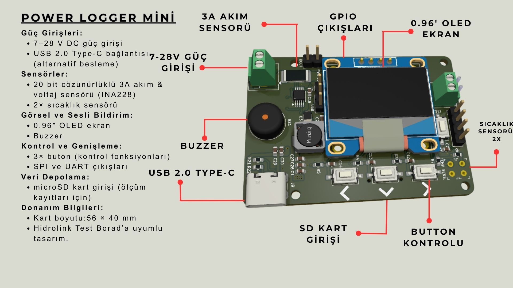
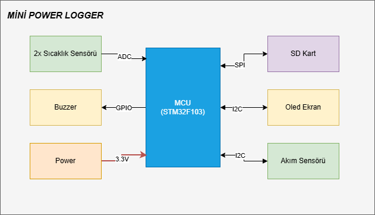
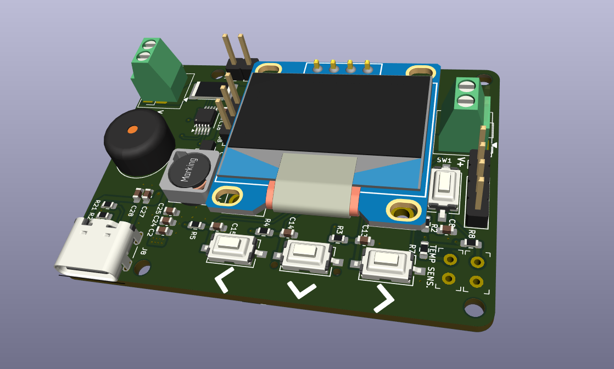
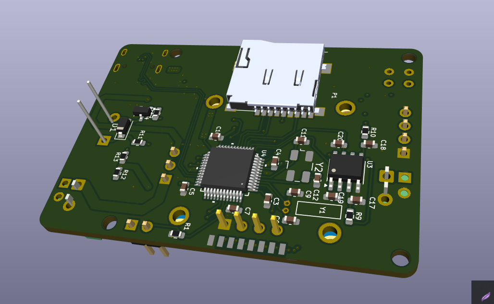

# Mini Power Logger

> **Hazırlayan:** Oğuzhan ESEN  
> **Proje Adı:** Mini Power Logger
> **Tarih:** 11 Kasım 2025
> **Versiyon:** v1.0
---

## İçindekiler

---

## 1. Giriş

Mini Power Logger, gerilim, akım ve güç tüketimini ölçmek, bu verileri hafızaya kaydetmek ve ekran üzerinden anlık olarak göstermek amacıyla geliştirilmiş bir izleme kartıdır.

Sistem, STM32F103 mikrodenetleyici tabanlıdır ve INA228 yüksek çözünürlüklü akım–voltaj sensörü sayesinde 20 bit çözünürlükte hassas ölçüm yapabilmektedir. Ayrıca  ölçülen veriler microSD karta kaydedebilmekte ve aynı zamanda OLED ekranda anlık değerler görülebilmektedir.

Mini Power Logger, arge projelerinde üzeritilen prototip ve cihazların güç tüketimini incelemek amacıyla tasarlanmıştır.

---

## 2. Tasarımın Amacı ve Kapsamı

Bu tasarımın temel amacı, enerji tüketimini düşük maliyetle, taşınabilir bir sistem üzerinden izleyebilmek ve ölçüm sonuçlarını kolayca kayıt altına almaktır.
Mini Power Logger, aşağıdaki fonksiyonları yerine getirir:

* 7–28 V DC aralığında güç girişi

* INA228 sensörü ile akım ve voltaj ölçümü (3 A'e kadar)

* microSD kart üzerinden veri kaydı

* 0.96” OLED ekran ile anlık ölçüm gösterimi

* USB Type-C bağlantısı (alternatif besleme ve veri aktarımı)

* 2 adet sıcaklık sensörü (cihazın çeşitli konumlarında sıcaklık ölçümü alabilmek için)

* 3 adet buton (menü kontrolü ve fonksiyon seçimi)

* Buzzer ile sesli uyarı

---

## 3. Sistem Blok Diyagramı

---

## 4. Şematik ve PCB
[Şematik tasarım için tıklayın.](docs/mini_power_logger.pdf)

---

## 5. Test Notları

---

## 6. Geliştirme ve İyileştirme Önerileri

